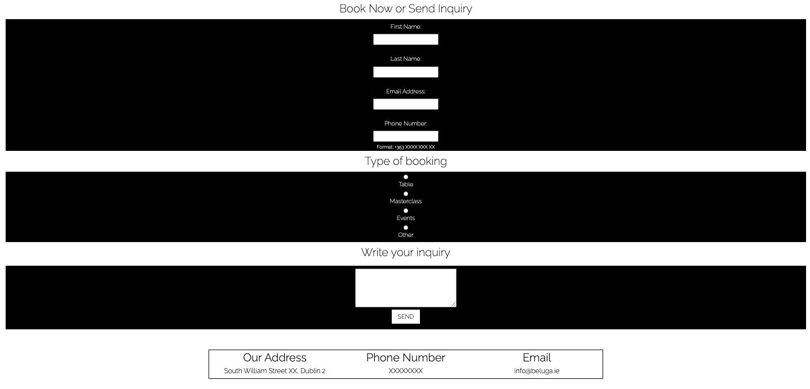
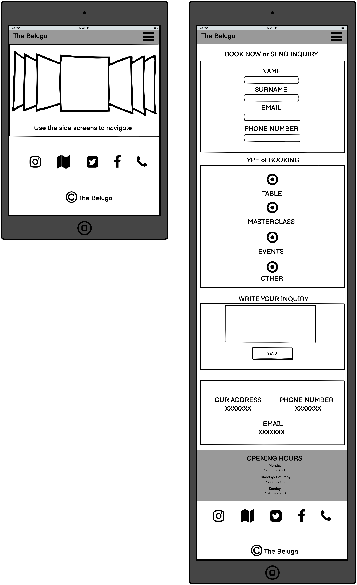
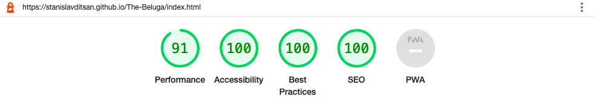

The Beluga Lounge Bar is a brand new venue in the heart of Dublin. To differentiate itself from their competitors, the beluga bar needs a modern, user friendly and fully functional website. This website was created to assist the business in becoming more visible, boosting sales, increasing bookings and providing all of the necessary information about the business.
 
#### To view the website click [here](https://stanislavditsan.github.io/The-Beluga/)

# Table of Content
- [User Experience](#user-experience)

  * [UX](#user-experience)

  * [Main Objectives](#main-objectives)

- [Features](#features)

  * [Navigation bar](#navigation-bar)

  * [Landing page](#landing-page)

  * [About us ](#about-us )

  * [Masterclasses](#masterclasses)

  * [Events](#events)

  * [Opening hours](#opening-hours)

  * [Footer](#footer)

  * [Menu](#menu)

  * [Extra feature for the menus](#extra-feature)

  * [Gallery](#gallery)

  * [Contacts](#contacts)

  * [Extra feature](#extra-feature)

- [Design](#design)

  * [Color Scheme](#color-Scheme)

  * [Imagery](#imagery)

  * [Typography](#typography)

  * [Icons](#icons)

- [Wireframes](#wireframes)

  * [Desktop](#desktop)

  * [Tablet](#tablet)

  * [Mobile](#mobile)

- [Languages Used](#languages-used)

- [Technologies Used and Tools](#technologies-used-and-tools)

- [Testing](#testing)

  * [Lighthouse](#lighthouse)

  * [Code Validation](#code-validation)

  * [Browser Compatibility](#browser-compatibility)

  * [Responsiveness](#responsiveness)

- [Bugs](#bugs)  

- [Deployment](#deployment) 

- [Credits](#credits)

  * [Content](#content)

  * [Media](#media)

  * [Acknowledgements](#acknowledgements)

  

 
# User Experience
## As a first time visitor I am able to: 

- Access the website from any piece of technology  such as smartphone, tablet, laptop or computer and be able to view all of the original content without any loss.

- Navigate the website across all pages. 

- Experience high-quality content including video & gallery. 

- Experience simple but modern design.

- Be able to view and  instantly share drink & food menus with your friends or colleagues before the upcoming booking. 

- To see a brief description about what the venue is providing. 

- Easily be able to view information about upcoming events.

- Ability to get in contact or to make a booking or to send inquiry.

- Ability to quickly view working hours and the location.

# Main Objectives 

- Expose the business to more customers. 

- Increase bookings by providing clear booking information.

- Advertise your upcoming events to boost sales(cocktail masterclasses, music performances etc)

- Ensure flawless SEO, to boost Google search results.

# Features

## Navigation bar 

- Navigation bar allows the user to easily access all the features of the website.

- The navigation bar remains in clear view or remains accessible throughout all of the website pages.

- The navigation bar includes: home, menu, about us, gallery and contact.

- Navigation bar code snippet was taken from bootstrap 4.6 getbootstrap.com

- Navigation bar is built to work on both big and small screens.

 

## Landing page

- The landing page showcases the business logo, a signature catchphrase to draw in the user and striking image of the bar. 

## About us 

- This section aims to describe the lounge bar and all of its features. It gives the user a brief overview of the business and entices them to learn more.

## Masterclasses 

- This section is for those having to look for an awesome activity to share with their friends in a fun way by booking our cocktail class.

## Events 

- This section is dedicated to up-and-coming events with a clear way to book. It also lists the dates, times, schedule and price.

## Opening hours 

- Clearly listed the opening days and hours for our users.

## Footer 

- Links to The Beluga's important social media, location and a phone call button are provided in the footer section.

- The links will open in a new tab for the user's convenience. 

- The user benefits from the footer since it encourages them to stay engaged on social media and easily find the venue or to get in touch.

## Menu
- The menu are separated into two sections one for the drinks and one for the snacks.

- The drinks menu has a welcome video showing A mouthwatering cocktail to tempt users to keep scrolling.

- The menu is themed around an ocean to incorporate the bar logo and name. 

- Cocktails are named after a different oceans or marine related.

- To keep with the marine theme the food menu is called bait.

## Extra feature for the menus

- The menus were embedded from [Canva.com](https://www.canva.com/) meaning they can be easily edited by the business owner and instantly publish any updates. Like price increases or just a simple menu change.

- Both menu‘s feature button which enables the user to easily share the menus on social media networks.

 

## Gallery 

- For the gallery section I decided to go with the bootstrap carousel to make it easier for the user to scroll through the photos.

 

## Contacts

- The contact page includes a form which allows users to easily get in touch with any kind of enquiries or related questions.

- It also has general contact information such as phone email and address.

## Extra feature 

- Quick scroll to the top arrow button is present across all web pages.

- Code snippet was taken from [Code Boxx](https://code-boxx.com/).

# Design

## Color Scheme

- The two primary colors are black and white.

## Imagery 

- The meaningful visual images are intended to be eye-catching and draw the user's attention. It also has a modern, vibrant appearance.

## Typography

- Raleway is an elegant sans-serif typeface family. Initially designed by Matt McInerney as a single thin weight, it was expanded into a 9 weight family by Pablo Impallari and Rodrigo Fuenzalida in 2012 and iKerned by Igino Marini.

- This font would be the ideal choice for all different types of modern and old-style designs.

## Icons

- The icons used in this project are provided by Font Awesome. They were used as social media icons and buttons to contact and find the venue.

# Wireframes
 The Wireframes were created using [Balsamiq](https://balsamiq.com/wireframes/)

## Desktop 
 - Index & Menu 

- Gallery & Contact

## Tablet
- Index & Menu 

- Gallery & Contact

## Mobile
- Index & Menu

- Gallery & Contact

# Languages Used

- [HTML](https://html.com/)
- [CSS](https://www.w3.org/Style/CSS/Overview.en.html)
 
# Technologies Used and Tools

### [Bootstrap 4.6](https://getbootstrap.com/docs/4.6/getting-started/introduction/)

- Bootstrap was utilized to help with the website's responsiveness and style.

### [Google Fonts](https://fonts.google.com/)

- Google fonts were used to import the 'Raleway' font into the style.css file which is used on all pages throughout the project.

### [Font Awesome](https://fontawesome.com/)

- Font Awesome was used on some of pages throughout the website to add icons for aesthetic and UX purposes.

### [jQuery 3.5](https://blog.jquery.com/2020/04/10/jquery-3-5-0-released/)

- jQuery came with Bootstrap to make the navbar responsive but was also used for the smooth scroll function in JavaScript.

### [GitPod](https://gitpod.io/)

- Gitpod was used to edit code within the project for the site and to push commitments. 

### [GitHub ](https://github.com/)

- GitHub was used to create the repository and store the project code after it has been pushed from Git.

### [Balsamiq](https://balsamiq.com/wireframes/)

- During the design phase, the wireframes were produced using Balsamiq.

### [Google Chrome](https://www.google.com/chrome/)

- Chrome was used for debugging and testing the source code and testing the responsiveness of the website.

### [Am I Responsive](https://ui.dev/amiresponsive/)

- Used to generate the live site images, and to test responsiveness.

### [W3C Markup Validation Service](https://validator.w3.org/)

- This service was used to check the HTML and CSS files for errors.

# Testing

## Lighthouse
- Chrome DevTools' Lighthouse is used to audit a site for performance, accessibility, progress, and SEO.

## Here are some of the outcomes

### Desktop

### Mobile

# Code Validation

### W3C HTML Validator
- Home Page

- Menu

- Gallery

- Contact

## W3C CSS Validator
### CSS validator passed with no errors

## Browser Compatibility
- The site was tested on Google Chrome, Safari, and Mozilla Firefox and found to be error-free. Appearance, functionality, and responsiveness remained consistent across a variety of device sizes and browsers.

## Responsiveness
- Responsive design tests were performed using [Google Chrome DevTools](https://developer.chrome.com/docs/devtools/).

- I also tested it on an iPhone 8 Plus, an iPhone 11, an iPad Pro, and a MacBook Air.

# Bugs

## I discovered a few bugs while working on this project.

1. When I added the bootstrap link rel="stylesheet" my css stylesheet stopped working.

## How did I solve this problem?

I simply moved the bootstrap link above my href="assets/css/style.css"

2. Carousel control buttons for scrolling overlayed navigation bar preventing use of some navigation buttons

## How did I solve this problem?

I added margin-top and width
.carousel-control-next, .carousel-control-prev {
    margin-top: 3rem;
    width: 30px;
}

3. When the navigation bar was expanded on small screens, the carousel control arrows did not drop down with it, resulting arrows overlying navigation buttons

 

## How did I solve this problem?

I couldn't figure out how to fix this problem so that I could keep the arrows when expanding the navigation bar on small screens.
My solution was to simply hide the arrow buttons and place a note beneath the gallery that said "Use the side screens to navigate."

# Deployment

## This project was created with the [GitPod](https://gitpod.io/) by committing to git and pushing to [GitHub ](https://github.com/).

The following steps were taken to deploy this page to GitHub pages from its specific GitHub repository:

1. The first step is to sign in to Github and navigate to the appropriate repository.

2. Click the settings button at the top of the repository.

3. Scroll down to the section GitHub Pages.

4. Select the Main branch under Source.

5. Hit Save button, and the website is now deployed.

6. The webpage's URL can be found at the top of the GitHub Pages section.

## How should this project be carried out locally?

To clone this project from GitHub, follow these steps:

1. Access the Project GitHub repository.

2. Under the repository name click on the ‘Code’ tab

3. Click the clipboard icon in the clone box's HTTPS tab.

4. Open GitBash in your IED.

5. Change your current working directory to the location where the cloned directory will be created.

6. Type "git clone" and then paste the GitHub URL.

7. Press enter and the local clone will be created.

## How to Fork the Repository?

Forking the repository creates an alternate copy that can be edited without affecting the original.

1. Log in to Github and navigate to the desired repository.

2. Click "fork" at the top of the repository.

3. A copy of your github account will now be created.

# Credits
- By using [Stack Overflow ](https://stackoverflow.com/) many code problems have been solved. 

- [Bootstrap](https://getbootstrap.com/docs/4.6/getting-started/introduction/) library was used throughout the project, primarily to make the site responsive.

- To add a quick scroll arrow to the top, a code snippet from [Code Boxx](https://code-boxx.com/) was used.

- [Canva](https://www.canva.com/) was used to create beautiful menus that were then embedded in HTML. Logo was created by Canva as well.

- [W3Schools](https://www.w3schools.com/) is used for inspiration, ideas, and problem solving.

-  The README.md was inspired by several other students I came across and [Code Institute Solutions](https://github.com/Code-Institute-Solutions).

- [Font Awesome](https://fontawesome.com/) was used to include footer icons such as social media and contact buttons.

### Content
- All content created by Stanislav Ditsan

### Media 

- All project images and video are from [Pexels](https://www.pexels.com/)

- Arrow icon button for quick scroll to top was used by [SVGrepo](https://www.pexels.com/)

## Acknowledgements
- I want to express my gratitude to Harry Dhillon, my course mentor, for his support and direction during the project.

- I also want to thank my wife, who has helped keep me calm and focused, as well as other of my coworkers who have had a similarly challenging route.

- I appreciate the assistance with certain technical challenges from Codeinstitute [Student Support](https://learn.codeinstitute.net/ci_support/diplomainsoftwaredevelopmentecommerce/support/).
